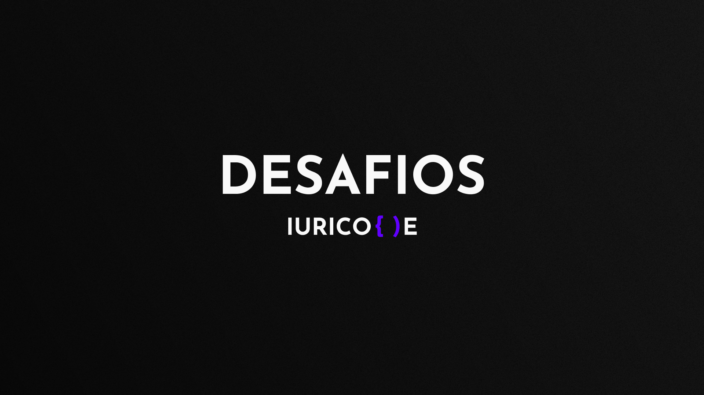
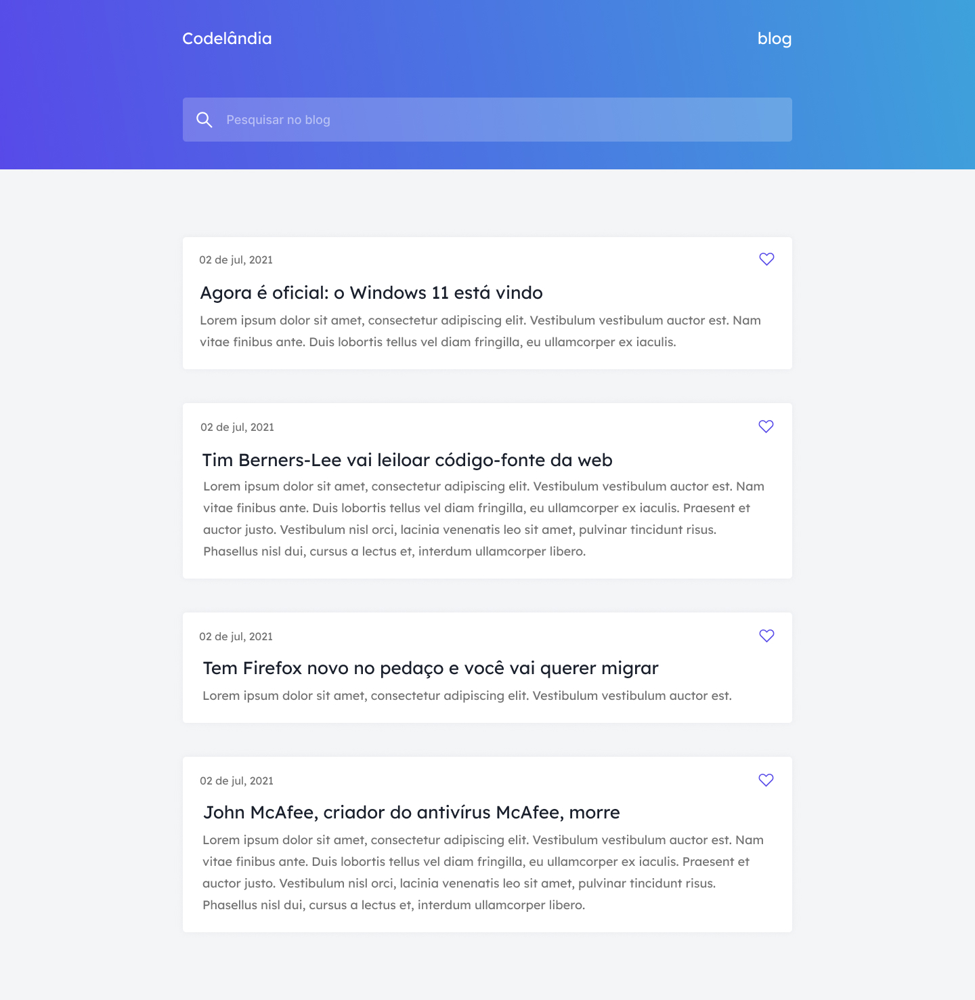
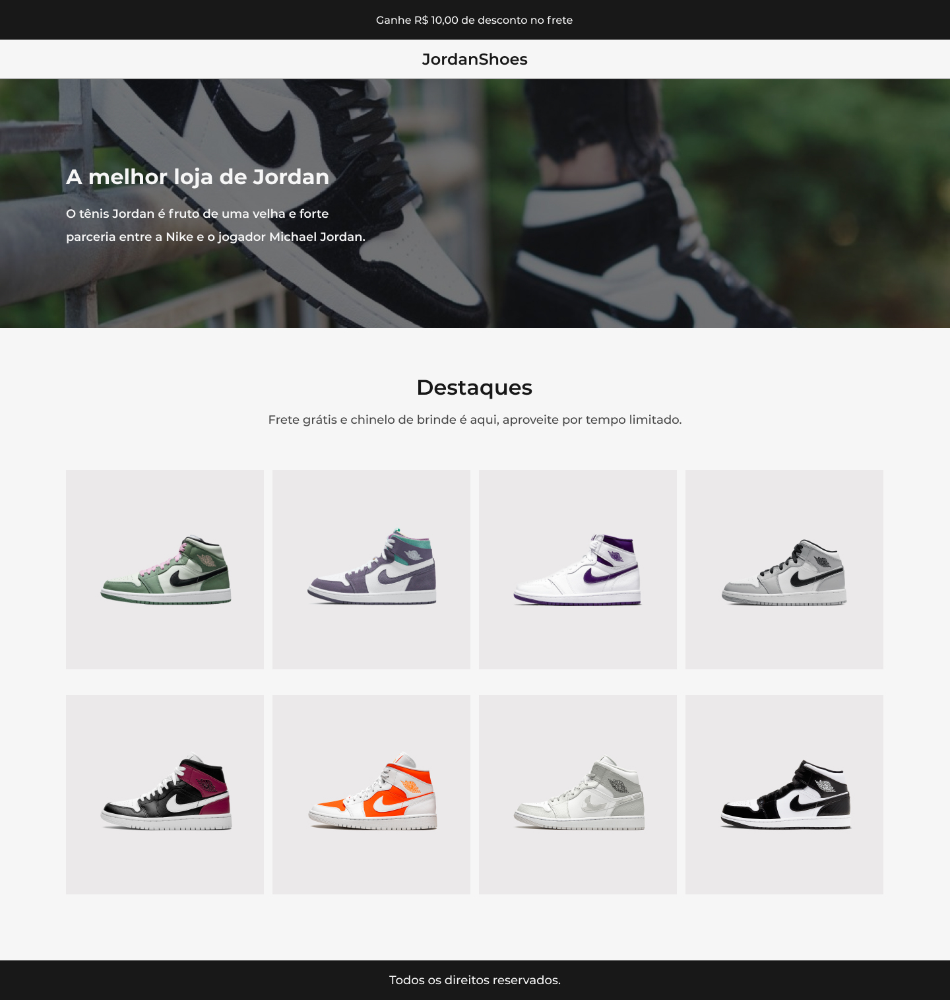
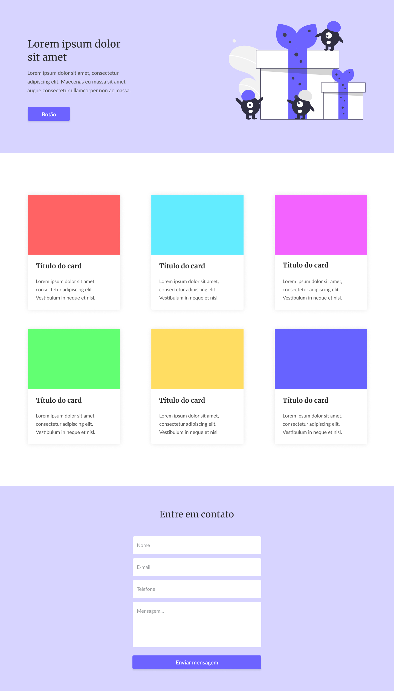
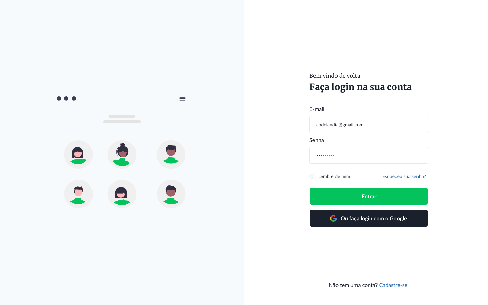
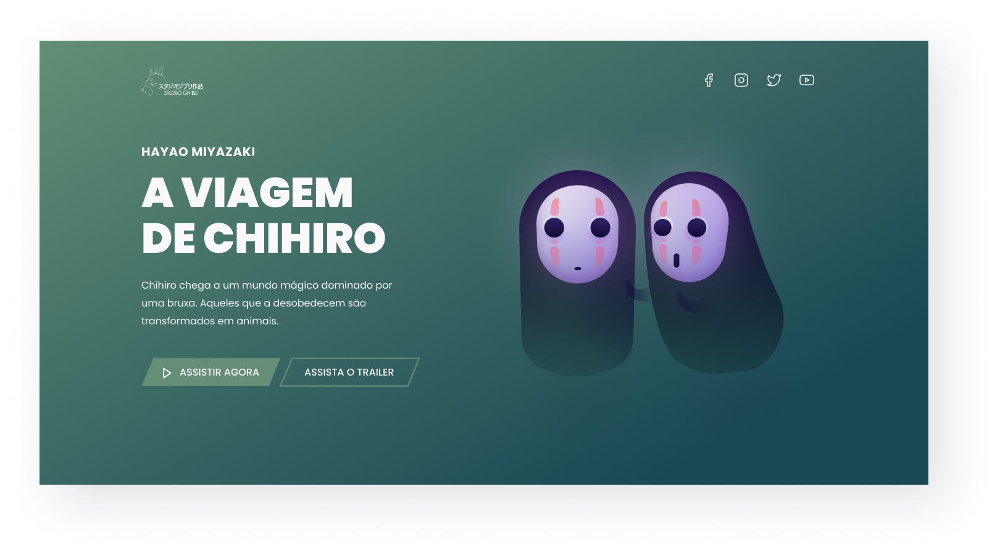
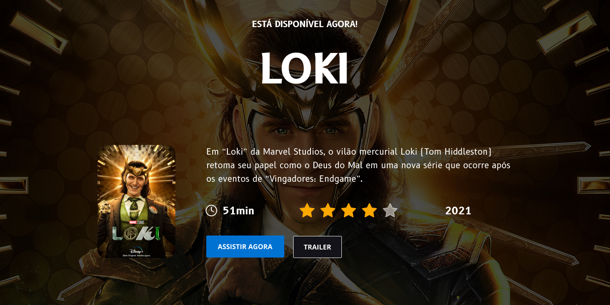
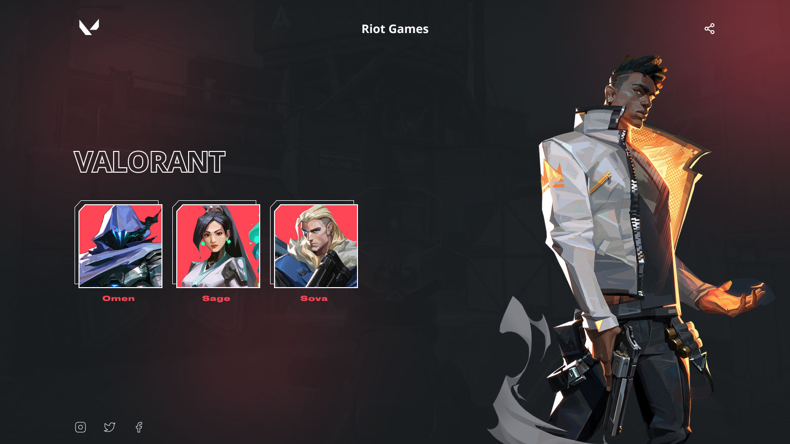
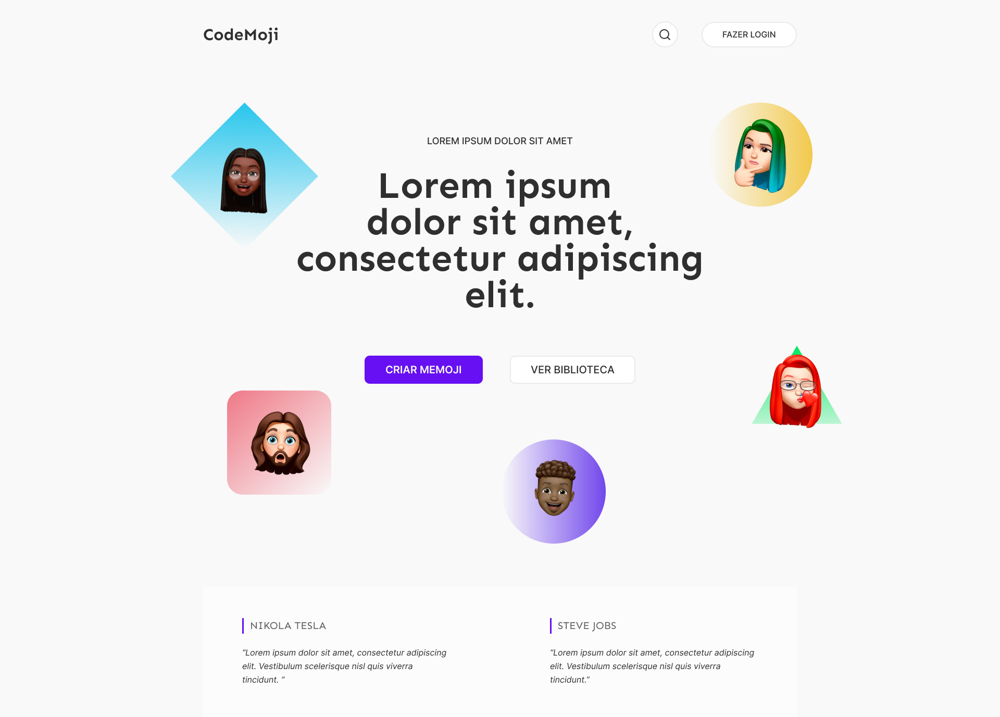

 

# Desafios IuriCode 💻

 

## 📌 Sobre

### 🥇 Bem vindo Dev, aqui estarei colocando o resultado de todos os desafios propostos por <a href="https://www.linkedin.com/in/iuricode/" target="_blank">IuriCode</a>. No qual ele fornece o layout projetado no Figma e permite a divulgação do resultado.

 

 

# 🎯 Projetos que foram e serão realizados. 

 
 

## ✨ Desafio 1 - IuriCode (Blog de Notícias) 💻
 

### Status: Concluído ✅
### 🧐 Confira o resultado <a href="https://codelandia-blog-torrico.netlify.app" target="_blank">aqui</a> 🧐

 
 

## ✨ Desafio 2 - IuriCode (JordanShoes) 💻
 

### Status: Concluído ✅
### 🧐 Confira o resultado <a href="https://jordanshoes-torrico.netlify.app" target="_blank">aqui</a> 🧐

 
 

## ✨ Desafio 3 - IuriCode (OnePage) 💻
 

### Status: Concluído ✅
### 🧐 Confira o resultado <a href="https://one-page-torrico.netlify.app" target="_blank">aqui</a> 🧐

 
 

## ✨ Desafio 4 - IuriCode (Login) 💻
 

### Status: Concluído ✅
### 🧐 Confira o resultado <a href="https://login-torrico.netlify.app" target="_blank">aqui</a> 🧐

 
 

## ✨ Desafio 5 - IuriCode (A Viagem de Chihiro) 💻
 

### Status: Concluído ✅
### 🧐 Confira o resultado <a href="https://codelandia-blog-torrico.netlify.app" target="_blank">aqui</a> 🧐

 
 

## ✨ Desafio 6 - IuriCode (Loki) 💻
 

### Status: Concluído ✅
### 🧐 Confira o resultado <a href="https://loki-torrico.netlify.app" target="_blank">aqui</a> 🧐

 
 

## ✨ Desafio 7 - IuriCode (Valorant) 💻
 

### Status: Concluído ✅
### 🧐 Confira o resultado <a href="https://valorant-torrico.netlify.app" target="_blank">aqui</a> 🧐

 
 

## ✨ Desafio 8 - IuriCode (CodeMoji) 💻
 

 

### Status: Concluído ✅
### 🧐 Confira o resultado <a href="https://valorant-torrico.netlify.app" target="_blank">aqui</a> 🧐

 

## ✨ Links uteis

### ⚫ Design dos projetos: <a href="https://www.figma.com/file/Yb9IBH56g7T1hdIyZ3BMNO/Desafios---Codelândia?node-id=624%3A2" target="_blank">Clique aqui</a>
### ⚫ Criador do desafio <a href="https://www.linkedin.com/in/iuricode/" target="_blank">Clique aqui</a>
  
 

## 💻 Tecnologias utilizadas nos desafios

### ✅ HTML 
### ✅ CSS
### ✅ JavaScript
