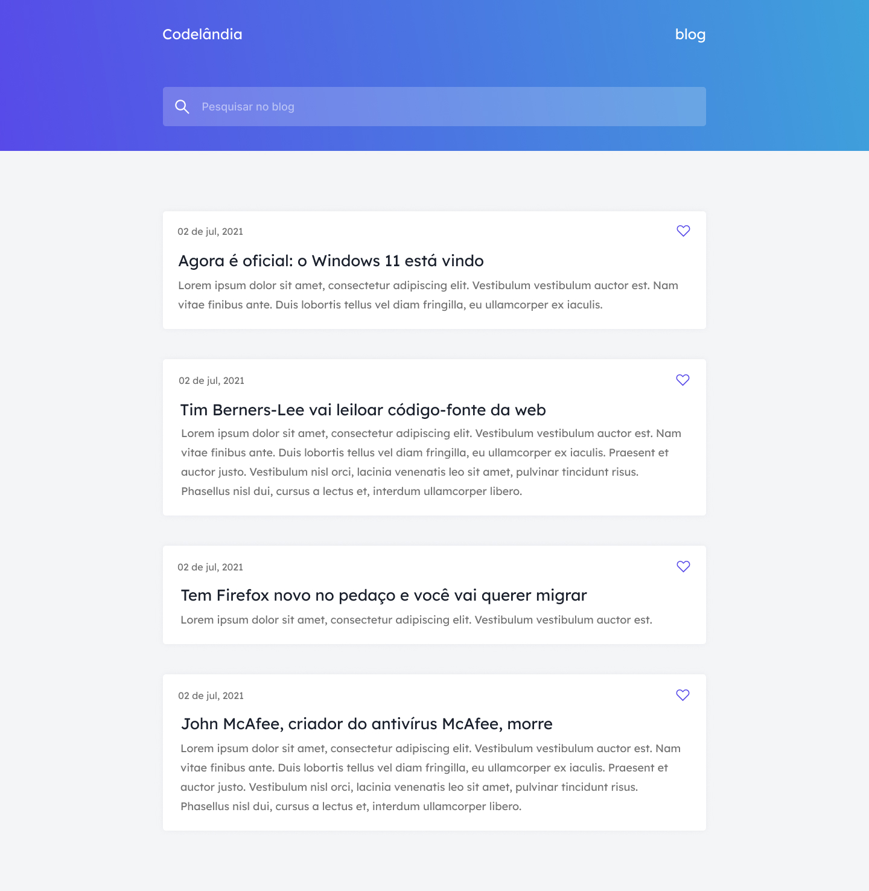

# Desafio 1 - IuriCode (Blog de Notícias) 💻

 

## 📌 Sobre

#### 🥇 Primeiro projeto dos desafios propostos por  <a href="https://www.linkedin.com/in/iuricode/" target="_blank">IuriCode</a> no qual ele fornece o layout projetado no Figma.

 

## 🎯 Projeto

 

 

## Links uteis

#### ⚫ Design do projeto: <a href="https://www.figma.com/file/Yb9IBH56g7T1hdIyZ3BMNO/Desafios---Codelândia?node-id=0%3A1" target="_blank">Clique aqui</a>
#### ⚫ Criador do desafio <a href="https://www.linkedin.com/in/iuricode/" target="_blank">Clique aqui</a>
  
 

## Tecnologias utilizadas

#### ✅ HTML 
#### ✅ CSS
#### ✅ JavaScript

 

## Resultado

#### 🧐 Confira o resultado clicando <a href="https://codelandia-blog-torrico.netlify.app" target="_blank">aqui</a>