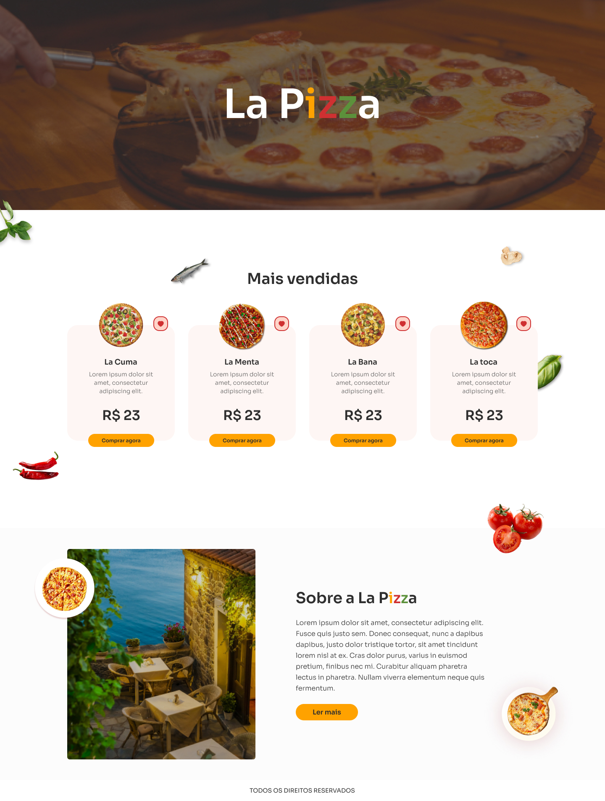

# Desafio 12 - IuriCode (Naped) 💻

 

## 📌 Sobre

### 🥇 Décimo segundo projeto dos desafios propostos por  <a href="https://www.linkedin.com/in/iuricode/" target="_blank">IuriCode</a> no qual ele fornece o layout projetado no Figma.

 

## 🎯 Projeto

 

 

## ✨ Links uteis

### ⚫ Design do projeto: <a href="https://www.figma.com/file/Yb9IBH56g7T1hdIyZ3BMNO/Desafios---Codelândia?node-id=31145%3A4" target="_blank">Clique aqui</a>
### ⚫ Criador do desafio: <a href="https://www.linkedin.com/in/iuricode/" target="_blank">Clique aqui</a>
  
 

## 💻 Tecnologias utilizadas

### ✅ HTML
### ✅ CSS

 

## 🎉 Resultado

### 🧐 Confira o resultado clicando <a href="https://la-pizza-torrico.netlify.app" target="_blank">aqui</a>